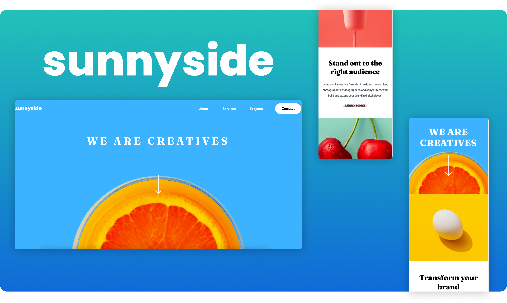

### Screenshot

Try this markdown:

### Links

- Solution URL: https://www.frontendmentor.io/challenges/sunnyside-agency-landing-page-7yVs3B6ef/hub/sunnyside-agency-landing-page-cyvSuiNCEs
- Live Site URL: https://sunnysideagencydesign.netlify.app/

### Built with

- Semantic HTML5 markup
- CSS custom properties
- Flexbox
- CSS Grid
- Mobile-first workflow
- Javascript

### This challenge by Frontendmentor.io
